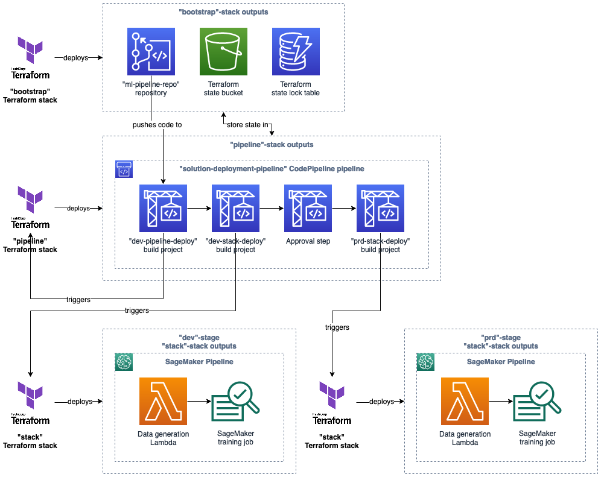
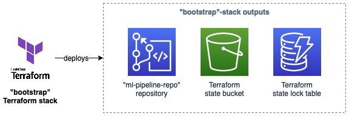
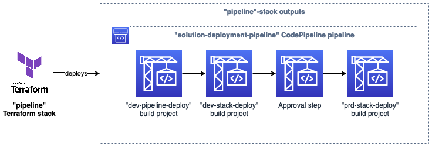
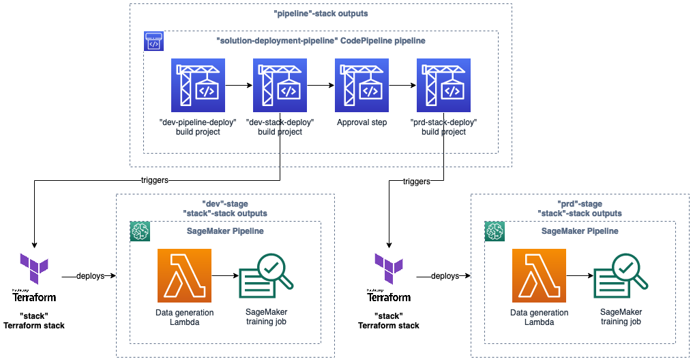

# MLOps with Terraform, Amazon SageMaker, and AWS Code Pipeline

*An MLOps continuous delivery solution with Terraform, AWS CodePipeline, AWS CodeBuild, and Amazon SageMaker Pipelines.*



## Solution description

This solution deploys a continuous delivery solution via CodePipline and CodeBuild, with a focus on deploying an ML solution via SageMaker. 

When this solution is deployed, any changes made to the CodeCommit repository will be automatically deployed and tested in a `dev` environment, where they can then be promoted into an independent `prd` environment. 

This solution is defined and deployed using Terraform, making use of the [S3](https://www.terraform.io/language/settings/backends/s3) backend configuration. To make this deployment as easy as possible, this solution includes a `bootstrap` stack that deploys the required AWS infrastructure for future steps.

The user must initally deploy the `pipeline` stack. Once this is configured, deployments (including updates to the `pipeline` stack!) will be handled by CodePipeline. 

### Solution features 

* `bootstrap` Terraform stack to deploy AWS infrastructure required for remote Terraform state management, as well as CodeCommit repository
* `pipeline` Terraform stack to deploy a CodePipeline/CodeBuild solution to update the `pipeline` Terraform stack, deploy and test the `stack` Terraform stack in `dev` and `prd`
* `stack` Terraform stack to deploy a basic ML solution, including:
    * a Lambda to generate a (toy) training dataset, 
    * a SageMaker training job to train an ML model on this dataset,
    * a SageMaker Pipeline to coordinate this process
* An acceptance tests in the `stack` Terraform stack to verify the SageMaker Pipeline functions as required

## Requirements

### Deployment

In order to deploy this solution, you will need a command line environment enabled with:

* [Terraform CLI](https://learn.hashicorp.com/tutorials/terraform/install-cli)
* [Git](https://git-scm.com/downloads)
* [AWS CLI](https://docs.aws.amazon.com/cli/latest/userguide/getting-started-install.html), connected to an AWS account.
* Python, with the [`git-remote-codecommit`](https://pypi.org/project/git-remote-codecommit/) package installed.

### Further development

To continue development of this solution, you may carry out development locally. In that case, you will require, in addition to the applications above, 

* Python 3.9 (or above)
* [`pipenv`](https://pypi.org/project/pipenv/) package installed

The Python environment for this solution can be re-installed using [pipenv](https://pipenv.pypa.io/en/latest/) and the `Pipfile` in the root directory. 

## Quickstart

Follow the sections below to deploy this entire solution.

### Create a local copy of this repo:

Clone the repo to your local machine, and open a terminal in the new repo.

```bash
$ ls  # Demonstrate we are in the right folder
Pipfile         Pipfile.lock    pyproject.toml  readme.md       setup.py        src             terraform       workflows
```

### Deploy the Terraform "Bootstrap" stack:

* Move to the `bootstrap` Terraform stack directory and deploy it via Terraform. 
```bash
$ cd terraform/bootstrap
$ terraform init
$ terraform apply
```
Approve the deployment of the Terraform stack when requested.



### Configure the Terraform "Pipeline" stack and push the repository into your account:

While in the `bootstrap` Terraform stack directory, run the following script to set variables of the `pipeline` Terraform stack automatically and push the repository into your account:
```bash
$ ./configure_pipeline_stack.sh
```

### Deploy the Terraform "Pipeline" stack:

Move to the `pipeline` Terraform stack directory and deploy it via Terraform. 
```bash
$ cd ../pipeline
$ ./init.sh
$ ./deploy.sh
```
Approve the deployment of the Terraform stack when requested.



### Outputs

Upon completion, a new pipeline will be deployed and running within AWS CodePipeline (named `solution-deployment-pipeline` by default). 



This pipeline will:
* Run a AWS CodeBuild build project to deploy and update the `pipeline` Terraform stack. However, as the pipeline has just been deployed, this build will effectively do nothing.
* Run a AWS CodeBuild build project to, in a `dev` environment,
    * Deploy the `stack` Terraform stack 
    * Deploy a SageMaker Pipeline, utilising resources deployed in the `stack` Terraform stack
    * Run the SageMaker pipeline
* Pause for permission to deploy into `prd`. 

## Troubleshooting

### ISSUE: My `pipeline` CodeBuild Project is broken and the pipeline can no longer update itself.

If the `pipeline` CodeBuild project breaks (due to environment variable reorganisations, re-organisation of the project, etc) you may need to redeploy the `pipeline` Terraform stack manually.
